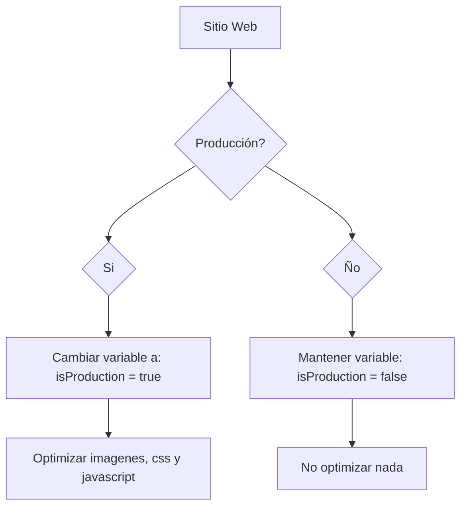

# Frontend config - Diego Gutiérrez

A continuación detallo de manera específica, todos los elementos necesarios para iniciar a maquetar un **micrositio** cómodamente. Cabe mencionar que es necesario contar con **software de diseño** algunas **dependencias de Node js**, así como **Gulp 4.**

# Gestión de tareas con - Gulp 4

En los micrositios que maqueto, siempre me mantengo en **HTML5, CSS y Javascript**, preprocesando _Pug para HTML y SASS para css_ con Gulp en su versión _**4.0.1**_. Independientemente de la tecnología en la que se programe el sitio, a menos de que sea indicado, se trabajará en un entorno diferente como: _React o Angular_ Dicho esto, continuo especificando:

### Dependencias para desarrollo:

Para trabajar con un micrositio hecho por mi, es necesario contar con los permisos en Mac de escritura en todas las carpetas.* Una ves comprobado los permisos de usuario, procedemos a la instalación de las dependencias con el ***comando de instalación**:
- "browser-sync": "^2.26.7",
	> Para montar un servidor local. 
- "gulp": "^4.0.2",
	> Para gestionar todas las tareas.
- "gulp-autoprefixer": "^7.0.1",
	> Para no escribir prefijos de css 3 y navegadores viejos.
- "gulp-concat": "^2.6.1",
	> Para concatenar archivos.
- "gulp-cssnano": "^2.1.3",
	> Para minificar css.
- "gulp-header": "^2.0.9",
	> Para escribir la firma en los archivos.
- "gulp-if": "^3.0.0",
	> Gulp if, permite hacer condiciones en la gestión de tareas.
- "gulp-imagemin": "^6.1.1",
	> Para optimizar imagenes mediante línea de comando.
- "gulp-notify": "^3.2.0",
	> Para notificar cuando se haya ejecutado cualquier tarea de la lista.
- "gulp-plumber": "^1.2.1",
	> Para detectar errores dentro de las tareas.
- "gulp-pretty-html": "^2.0.10",	
	> Para mejorar el aspecto de indentación en los HTML.
- "gulp-pug": "^4.0.1",
	> Preprocesar Html con **Pug**.
- "gulp-sass": "^4.0.2",
	> Preprocesar CSS con **SASS**
- "gulp-uglify": "^3.0.2",
	> Para minificar javascript.
- "node-sass": "^4.12.0",
	> Para correr _Gulp Sass_
- "rupture-sass": "^0.3.0"
	> Para hacer media queries.

> *Si no se cuenta con los permisos correspondientes, se presentarán problemas a la hora de instalar Gulp y sus dependencias.

## Instalar Gulp 4 y trabajar según la etapa del proyecto:
Dentro del archivo **gulpfile.js** encontraremos la variable `isProduction` con la cual notificaremos al proyecto en que etapa de desarrollo nos encontramos, así, condicionamos su funcionalidad. En el siguiente diagrama se presenta como validamos su uso:

### Instalar dependencias del proyecto:
El **comando de instalación** desde teminal es: **`npm install --save-dev`**. 
Este comando instalará todas las dependencias mencionadas en **package.json**

### Trabajar con Gulp en la etapa de desarrollo:

Una ves instalado el proyecto con Gulp, mantenemos la variable: **`isProduction = false`** para evitar acabar con la memoria ram de nuestro equipo, ya que es sabido que Gulp, es ejecutado todas las veces en las que se guarda el proyecto.

Para correr el proyecto escribe en terminal: **`Gulp`**

### Preparar los archivos con Gulp en la etapa de producción:

Dentro del archivo _gulpfile.js_ cambiar la variable: **`isProduction = false`** a **`isProduction = true`**
Con ello las imagenes serán optimizadas y los archivos indicados serán minificados y se les agregará la firma del sitio. Pe:

`/*! Copyright © - 2019 Desarrollado para Ia Interactive */`
`.swiper-container{margin:0 auto;position:relative;overflow:hid...`

# Programas

### Diseño web
Para gestionar el diseño gráfico de los sites, es necesario contar con:

- **Adobe Photoshop - Ultima versión**
- **Adobe Illustrator - Ultima versión**
- **Sketch - Ultima versión**

Principalmente para dar seguimiento a los estilos y extraer assets.

### Frontend
Para gestionar el código de los sites, es necesario contar cualquiera de los 2 softwares:

- **Visual Studio Code - Ultima versión**
	- Con las dependencias:
		- Editorconfig for VS Code.
		- pug
		- sass
		
- **Sublime Text - Ultima versión**
	- Con las dependencias:
		- Editorconfig for Sublime text 3
		- Sass language
		- pug language

Cualquiera de los dos funciona muy bien, ya es cuestión de gustos y de vanguardias.

> **Nota:** Validar que estos programas tengan acceso completo como administradores, ya que gestionan ciertas carpetas y necesitan de todos los permisos.

# En resumen:

La lista de programas que se necesitan para maquetar un micrositio o landing:

|Diseño                          |Web                        |
|-------------------------------|-----------------------------|
|Adobe Photoshop - Ultima versión |[Node Js](https://nodejs.org/es/)
|Adobe Illustratir - Ultima versión | Visual Studio Code|
|Sketch |Sublime text 3|
| |**Parcel** _Opcional_|

